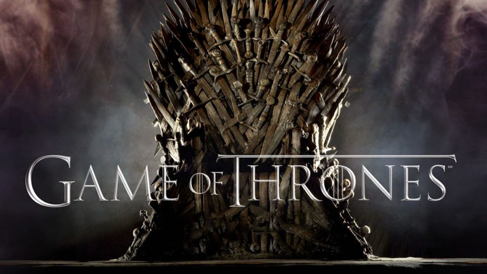

# North Remembers: A Game of Thrones Data Exploration
I may have arrived late to **Westeros**, but I have journeyed through Game of Thrones—HBO’s epic saga inspired by A Song of Ice and Fire by George R. R. Martin.This project dives into the scripts of the show, seeking to uncover the shifting voices of its characters and the rise and fall of its great houses not through prophecy but through the lens of data and visualization.....

## Datasets
This project is based on two datasets, First One **Character Dataset**. This file constitute information about the main characters in the show, including: 
- *Character name*
- *Actor/actress portraying them*
- *Number of episodes they appeared in*
- *Year of first appearance*
- *Year of last appearance*
This dataset helps analyze character presence across the series and compare how long different roles lasted.
**Dataset Source:** [Game of Thrones Character Dataset on Kaggle](https://www.kaggle.com/datasets/rezaghari/game-of-thrones) 

Second One **Script Dataset**. This file contains dialogue transcripts from every episode, with metadata about where and when each line was spoken. The main columns include: 
- *Release date*
- *Season and episode number*
- *Episode title*
- *Character name* 
- *Dialogue line (sentence spoken)*
This dataset allows for dialogue frequency analysis, tracking who spoke the most, and observing character presence across seasons.
**Dataset Source:** [Game of Thrones Script – All Seasons on Kaggle](https://www.kaggle.com/datasets/albenft/game-of-thrones-script-all-seasons)
  
Together, these datasets reveal patterns such as Tyrion Lannister’s dominance in dialogue, Jon Snow’s gradual rise, and the shifting balance of power between Starks, Lannisters, Targaryens, and beyond.
