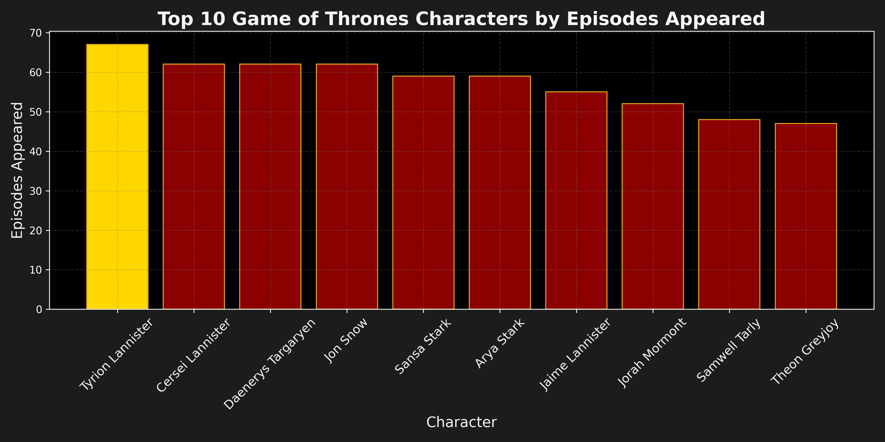
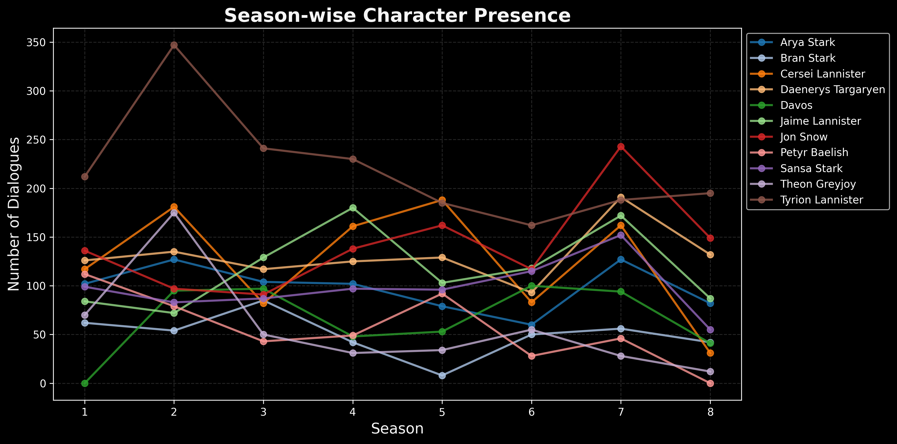

# North Remembers: A Game of Thrones Data Exploration
I may have arrived late to **Westeros**, but I have journeyed through Game of Thrones—HBO’s epic saga inspired by A Song of Ice and Fire by George R. R. Martin.This project dives into the scripts of the show, seeking to uncover the shifting voices of its characters and the rise and fall of its great houses not through prophecy but through the lens of data and visualization.....

## Datasets
This project is based on two datasets, First One **Character Dataset**. This file constitute information about the main characters in the show, including: 
- *Character name*
- *Actor/actress portraying them*
- *Number of episodes they appeared in*
- *Year of first appearance*
- *Year of last appearance*

This dataset helps analyze character presence across the series and compare how long different roles lasted.

**Dataset Source:** [Game of Thrones Character Dataset on Kaggle](https://www.kaggle.com/datasets/rezaghari/game-of-thrones) 

Second One **Script Dataset**. This file contains dialogue transcripts from every episode, with metadata about where and when each line was spoken. The main columns include: 
- *Release date*
- *Season and episode number*
- *Episode title*
- *Character name* 
- *Dialogue line (sentence spoken)*

This dataset allows for dialogue frequency analysis, tracking who spoke the most, and observing character presence across seasons.

**Dataset Source:** [Game of Thrones Script – All Seasons on Kaggle](https://www.kaggle.com/datasets/albenft/game-of-thrones-script-all-seasons)
  
Together, these datasets reveal patterns such as Tyrion Lannister’s dominance in dialogue, Jon Snow’s gradual rise, and the shifting balance of power between Starks, Lannisters, Targaryens, and beyond.

## Analysis and Finfings
### 1. The Voices of the Seven Kingdoms
Ever wondered who truly dominates the story of Game of Thrones? Is it Jon Snow, Daenerys Targaryen, or someone else? This analysis examines the top characters by episodes appeared in Game of Thrones, providing insight into who dominated the screen time across Westeros and Essos. One simple way to measure this is by screen presence—the number of episodes a character appears in. 

Let’s take a look at the top 10 characters by episodes appeared.

**Key Findings**

- *Tyrion Lannister*  – Frequently appearing across many episodes, his wit and schemes make him a central figure in the story.
- *Cersei Lannister*  – A major player in the political games of Westeros, her influence grows as her appearances accumulate over the seasons.
- *Jon Snow* – Steadfast and consistently present, his journey from the Wall to the heart of political intrigue makes him a narrative anchor.
- *Daenerys Targaryen*  – From Essos to Westeros, her dramatic rise is pivotal, though slightly less frequent than the Lannisters or Jon.
- *Other Supporting Characters*  – While appearing less often, they contribute meaningfully to key plot developments and interactions.

By analyzing episode appearances, we see how screen presence is distributed among the characters. Tyrion and the Lannisters (Cersei included) dominate the spotlight, Jon Snow provides a steady narrative backbone, and Daenerys’ appearances highlight her rising influence. Together, the mix of central and supporting characters shapes the rich tapestry of Westeros and Essos.

### 2. Shifting Faces of Power
In the sprawling saga of Game of Thrones, screen time and dialogue frequency ebb and flow across seasons, reflecting the rise, fall, and shifting focus of characters. This analysis tracks the top 11 characters in terms of dialogue count, across all eight seasons, revealing how narrative attention shifts over time.

Think of it as a timeline of influence: who dominated early seasons, who grew into prominence, and whose presence waned as the story progressed.
Season-wise Top 11 Characters

**Key Findings**

- *Tyrion Lannister*  – Consistently present across nearly all seasons, his dialogues highlight his central role in both political maneuvering and personal arcs.
- *Jon Snow* – Dialogue peaks in later seasons mirror his journey from the Wall to the heart of Westeros’ conflicts, marking him as a steady narrative anchor.
- *Cersei Lannister*  – Her prominence spikes in specific seasons where political intrigue dominates, reflecting her role as a cunning and ambitious player.
- *Daenerys Targaryen*  – Gradually rises through the middle seasons, corresponding with her storyline in Essos and eventual move toward Westeros.
- *Other Top Characters*  – Characters like Sansa Stark, Jaime Lannister, and Arya Stark show dynamic season-wise variation, illustrating how different story arcs take center stage at different times.

This seasonal analysis reveals that Game of Thrones balances its focus between central figures and emerging characters, allowing the story to shift naturally between arcs in Westeros and Essos. By tracking dialogue counts season by season, we gain insight into how narrative power ebbs and flows, which characters dominate specific seasons, and how ensemble dynamics enrich the saga.

